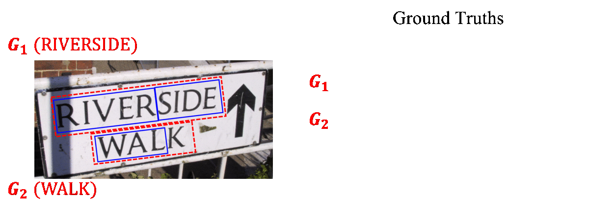
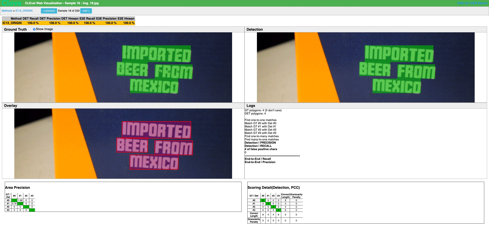

# CLEval: Character-Level Evaluation for Text Detection and Recognition Tasks

Official implementation of CLEval | [paper](https://arxiv.org/abs/2006.06244)

## Overview
We propose a Character-Level Evaluation metric (CLEval). To perform fine-grained assessment of the results, *instance matching* process handles granularity difference and *scoring process* conducts character-level evaluation. Please refer to the paper for more details. This code is based on [ICDAR15 official evaluation code](http://rrc.cvc.uab.es/).


### Simplified Method Description


## Notification
* 15 Jun, 2020 | initial release
  - the reported evaluation results in our paper is measured by setting the ```CASE_SENSITIVE``` option as ```False```. 

## Supported annotation types
* **LTRB**(xmin, ymin, xmax, ymax)
* **QUAD**(x1, y1, x2, y2, x3, y3, x4, y4)
* **POLY**(x1, y1, x2, y2, ..., x_2n, y_2n)

## Supported datasets
* ICDAR 2013 Focused Scene Text [Link](https://rrc.cvc.uab.es/?ch=2)
* ICDAR 2015 Incidental Scene Text [Link](https://rrc.cvc.uab.es/?ch=4)
* TotalText [Link](https://github.com/cs-chan/Total-Text-Dataset)
* Any other datasets that have a similar format with the datasets mentioned above

## Getting started
### Clone repository
```
git clone https://github.com/clovaai/CLEval.git
```

### Requirements
* python 3.x
* see requirements.txt file to check package dependency. To install, command
```
pip3 install -r requirements.txt
```

## Instructions for the standalone scripts
### Detection evaluation
```
python script.py -g=gt/gt_IC13.zip -s=[result.zip] --BOX_TYPE=LTRB          # IC13
python script.py -g=gt/gt_IC15.zip -s=[result.zip]                          # IC15
python script.py -g=gt/gt_TotalText.zip -s=[result.zip] --BOX_TYPE=POLY     # TotalText
```
* Notes
  * The default value of ```BOX_TYPE``` is set to ```QUAD```. It can be explicitly set to ```--BOX_TYPE=QUAD``` when running evaluation on IC15 dataset.
  * Add ```--TANSCRIPTION``` option if the result file contains transcription.
  * Add ```--CONFIDENCES``` option if the result file contains confidence.

### End-to-end evaluation
```
python script.py -g=gt/gt_IC13.zip -s=[result.zip] --E2E --BOX_TYPE=LTRB        # IC13
python script.py -g=gt/gt_IC15.zip -s=[result.zip] --E2E                        # IC15
python script.py -g=gt/gt_TotalText.zip -s=[result.zip] --E2E --BOX_TYPE=POLY   # TotalText
```
* Notes
  * Adding ```--E2E``` also automatically adds ```--TANSCRIPTION``` option. Make sure that the transcriptions are included in the result file.  
  * Add ```--CONFIDENCES``` option if the result file contains confidence.


### Paramter list
<!-- 
### Paramters for evaluation script
| name | type | default | description |
| ---- | ---- | ------- | ---- |
| -g | ```string``` | | path to ground truth zip file |
| -s | ```string``` | | path to result zip file |
| -o | ```string``` | | path to save per-sample result file 'results.zip' | -->

| name | type | default | description |
| ---- | ---- | ------- | ---- |
| --BOX_TYPE | ```string``` | ```QUAD``` | annotation type of box (LTRB, QUAD, POLY) |
| --TRANSCRIPTION | ```boolean``` | ```False``` | set True if result file has transcription |
| --CONFIDENCES | ```boolean``` | ```False``` | set True if result file has confidence |
| --E2E | ```boolean``` | ```False``` | to measure end-to-end evaluation (if not, detection evalution only) |
| --CASE_SENSITIVE | ```boolean``` | ```True``` | set True to evaluate case-sensitively. (only used in end-to-end evaluation) |
* Note : Please refer to ```arg_parser.py``` file for additional parameters and default settings used internally.

## Instructions for the webserver

### Procedure
1. Compress the GT file of the dataset you want to evaluate into ```gt.zip``` file and the image files into ```images.zip```.
2. Copy the two files to the ```./gt/``` directory.
3. Run web.py with ```BOX_TYPE``` option. 
```
python web.py --BOX_TYPE=[LTRB,QUAD,POLY] --PORT=8080
```

### Paramters for webserver
| name | type | default | description |
| ---- | ---- | ------- | ---- |
| --BOX_TYPE | ```string``` | ```QUAD``` | annotation type of box (LTRB, QUAD, POLY) |
| --PORT | ```integer``` | ```8080``` | port number for web visualization |


### Web Server screenshots



## TODO
- [ ] Support to run the webserver with the designated GT and image files
- [ ] Calculate the length of text based on grapheme for Mulit-lingual dataset

## Citation
```
@article{baek2020cleval,
  title={CLEval: Character-Level Evaluation for Text Detection and Recognition Tasks},
  author={Youngmin Baek, Daehyun Nam, Sungrae Park, Junyeop Lee, Seung Shin, Jeonghun Baek, Chae Young Lee and Hwalsuk Lee},
  journal={arXiv preprint arXiv:2006.06244},
  year={2020}
}
```

## Contact us
CLEval has been proposed to make fair evaluation in the OCR community, so we want to hear from many researchers. We welcome any feedbacks to our metric, and appreciate pull requests if you have any comments or improvements.

## License

```
Copyright (c) 2020-present NAVER Corp.

Permission is hereby granted, free of charge, to any person obtaining a copy
of this software and associated documentation files (the "Software"), to deal
in the Software without restriction, including without limitation the rights
to use, copy, modify, merge, publish, distribute, sublicense, and/or sell
copies of the Software, and to permit persons to whom the Software is
furnished to do so, subject to the following conditions:

The above copyright notice and this permission notice shall be included in
all copies or substantial portions of the Software.

THE SOFTWARE IS PROVIDED "AS IS", WITHOUT WARRANTY OF ANY KIND, EXPRESS OR
IMPLIED, INCLUDING BUT NOT LIMITED TO THE WARRANTIES OF MERCHANTABILITY,
FITNESS FOR A PARTICULAR PURPOSE AND NONINFRINGEMENT.  IN NO EVENT SHALL THE
AUTHORS OR COPYRIGHT HOLDERS BE LIABLE FOR ANY CLAIM, DAMAGES OR OTHER
LIABILITY, WHETHER IN AN ACTION OF CONTRACT, TORT OR OTHERWISE, ARISING FROM,
OUT OF OR IN CONNECTION WITH THE SOFTWARE OR THE USE OR OTHER DEALINGS IN
THE SOFTWARE.
```
