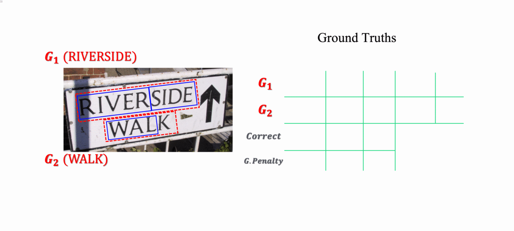

# CLEval: Character-Level Evaluation for Text Detection and Recognition Tasks

Official implementation of CLEval | [paper](https://arxiv.org/abs/2006.06244)

## Overview
We propose a Character-Level Evaluation metric (CLEval). To perform fine-grained assessment of the results, *instance matching* process handles granularity difference and *scoring process* conducts character-level evaluation. Please refer to the paper for more details. This code is based on [ICDAR15 official evaluation code](http://rrc.cvc.uab.es/).

### 2023.10.16 Huge Update
- **Much More Faster Version** of CLEval has been Uploaded!!
- Support CLI 
- Support torchmetric
- Support scale-wise evaluation


### Simplified Method Description


## Supported annotation types
* **LTRB**(xmin, ymin, xmax, ymax)
* **QUAD**(x1, y1, x2, y2, x3, y3, x4, y4)
* **POLY**(x1, y1, x2, y2, ..., x_2n, y_2n)

## Supported datasets
* ICDAR 2013 Focused Scene Text [Link](https://rrc.cvc.uab.es/?ch=2)
* ICDAR 2015 Incidental Scene Text [Link](https://rrc.cvc.uab.es/?ch=4)
* TotalText [Link](https://github.com/cs-chan/Total-Text-Dataset)
* Any other datasets that have a similar format with the datasets mentioned above

## Installation

### Build from pip
download from Clova OCR pypi
```bash
$ pip install cleval
```

or build with url
```bash
$ pip install git+https://github.com/clovaai/CLEval.git --user
```

### Build from source

```bash
$ git clone https://github.com/clovaai/CLEval.git
$ cd cleval
$ python setup.py install --user
```

## How to use
You can replace `cleval` with `PYTHONPATH=$PWD python cleval/main.py` for evaluation using source.
```bash
$ PYTHONPATH=$PWD python cleval/main.py -g=gt/gt_IC13.zip -s=[result.zip] --BOX_TYPE=LTRB 
```

### Detection evaluation (CLI)
```bash
$ cleval -g=gt/gt_IC13.zip -s=[result.zip] --BOX_TYPE=LTRB          # IC13
$ cleval -g=gt/gt_IC15.zip -s=[result.zip]                          # IC15
$ cleval -g=gt/gt_TotalText.zip -s=[result.zip] --BOX_TYPE=POLY     # TotalText
```
* Notes
  * The default value of ```BOX_TYPE``` is set to ```QUAD```. It can be explicitly set to ```--BOX_TYPE=QUAD``` when running evaluation on IC15 dataset.
  * Add ```--TANSCRIPTION``` option if the result file contains transcription.
  * Add ```--CONFIDENCES``` option if the result file contains confidence.

### End-to-end evaluation (CLI)
```bash
$ cleval -g=gt/gt_IC13.zip -s=[result.zip] --E2E --BOX_TYPE=LTRB        # IC13
$ cleval -g=gt/gt_IC15.zip -s=[result.zip] --E2E                        # IC15
$ cleval -g=gt/gt_TotalText.zip -s=[result.zip] --E2E --BOX_TYPE=POLY   # TotalText
```
* Notes
  * Adding ```--E2E``` also automatically adds ```--TANSCRIPTION``` option. Make sure that the transcriptions are included in the result file.  
  * Add ```--CONFIDENCES``` option if the result file contains confidence.

### TorchMetric
```python
from cleval import CLEvalMetric
metric = CLEvalMetric()

for gt, det in zip(gts, dets):
    # your fancy algorithm
    # ...
    # gt_quads = ...
    # det_quads = ...
    # ...
    _ = metric(det_quads, gt_quads, det_letters, gt_letters, gt_is_dcs)

metric_out = metric.compute()
metric.reset()
```

### Profiling
```bash
$ cleval -g=resources/test_data/gt/gt_eval_doc_v1_kr_single.zip -s=resources/test_data/pred/res_eval_doc_v1_kr_single.zip --E2E -v --DEBUG --PPROFILE > profile.txt
$ PYTHONPATH=$PWD python cleval/main.py -g resources/test_data/gt/dummy_dataset_val.json -s resources/test_data/pred/dummy_dataset_val.json --SCALE_WISE --DOMAIN_WISE --ORIENTATION --E2E --ORIENTATION -v --PROFILE --DEBUG > profile.txt
```

### Paramters for evaluation script
| name | type | default | description |
| ---- | ---- | ------- | ---- |
| -g | ```string``` | | path to ground truth zip file |
| -s | ```string``` | | path to result zip file |
| -o | ```string``` | | path to save per-sample result file 'results.zip' |

| name | type | default | description |
| ---- | ---- | ------- | ---- |
| --BOX_TYPE | ```string``` | ```QUAD``` | annotation type of box (LTRB, QUAD, POLY) |
| --TRANSCRIPTION | ```boolean``` | ```False``` | set True if result file has transcription |
| --CONFIDENCES | ```boolean``` | ```False``` | set True if result file has confidence |
| --E2E | ```boolean``` | ```False``` | to measure end-to-end evaluation (if not, detection evalution only) |
| --CASE_SENSITIVE | ```boolean``` | ```True``` | set True to evaluate case-sensitively. (only used in end-to-end evaluation) |
* Note : Please refer to ```arg_parser.py``` file for additional parameters and default settings used internally.

* Note : For scalewise evaluation, we measure the ratio of the shorter length (text height) of the text-box to the longer length of the image. 
Through this, evaluation for each ratio can be performed. To adjust the scales, please use SCALE_BINS argument.

## Citation
```
@article{baek2020cleval,
  title={CLEval: Character-Level Evaluation for Text Detection and Recognition Tasks},
  author={Youngmin Baek, Daehyun Nam, Sungrae Park, Junyeop Lee, Seung Shin, Jeonghun Baek, Chae Young Lee and Hwalsuk Lee},
  journal={arXiv preprint arXiv:2006.06244},
  year={2020}
}
```

## Contact us
CLEval has been proposed to make fair evaluation in the OCR community, so we want to hear from many researchers. We welcome any feedbacks to our metric, and appreciate pull requests if you have any comments or improvements.

## License
```
Copyright (c) 2020-present NAVER Corp.

Permission is hereby granted, free of charge, to any person obtaining a copy
of this software and associated documentation files (the "Software"), to deal
in the Software without restriction, including without limitation the rights
to use, copy, modify, merge, publish, distribute, sublicense, and/or sell
copies of the Software, and to permit persons to whom the Software is
furnished to do so, subject to the following conditions:

The above copyright notice and this permission notice shall be included in
all copies or substantial portions of the Software.

THE SOFTWARE IS PROVIDED "AS IS", WITHOUT WARRANTY OF ANY KIND, EXPRESS OR
IMPLIED, INCLUDING BUT NOT LIMITED TO THE WARRANTIES OF MERCHANTABILITY,
FITNESS FOR A PARTICULAR PURPOSE AND NONINFRINGEMENT.  IN NO EVENT SHALL THE
AUTHORS OR COPYRIGHT HOLDERS BE LIABLE FOR ANY CLAIM, DAMAGES OR OTHER
LIABILITY, WHETHER IN AN ACTION OF CONTRACT, TORT OR OTHERWISE, ARISING FROM,
OUT OF OR IN CONNECTION WITH THE SOFTWARE OR THE USE OR OTHER DEALINGS IN
THE SOFTWARE.
```

### Contribute
Please use pre-commit which uses Black and Isort.
```
$ pip install pre-commit
$ pre-commit install
```

##### Step By Step
1. Write an issue.
2. Match code style (black, isort)
3. Wirte test code.
4. Delete branch after Squash&Merge.

Required Approve: 1

## Code Maintainer
- Donghyun Kim (artit.anthony@gmail.com)
